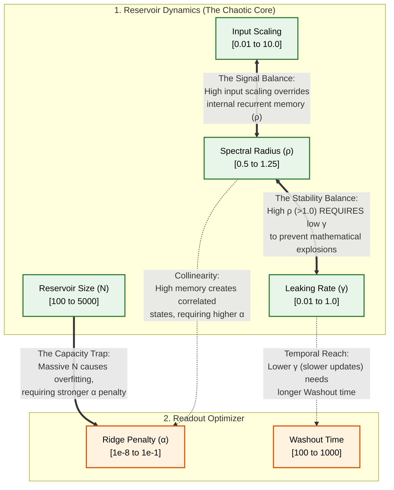
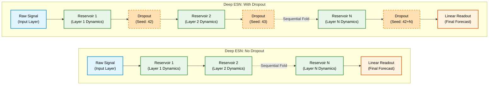
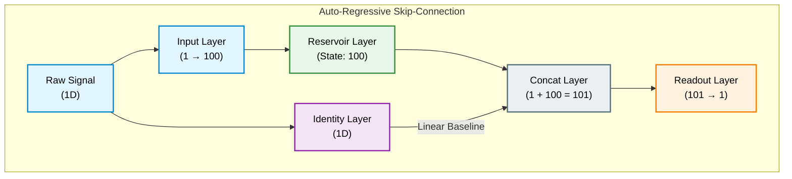
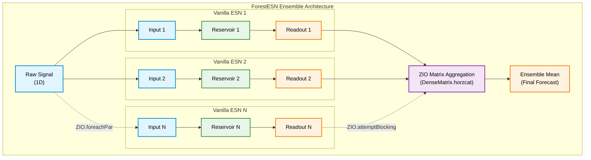

## An introduction to reservoir computing & Echo State Networks

Reservoir computing is a machine learning framework focused on efficiently processing temporal patterns and sequential data. Models built using this paradigm can be considered a form of Recurrent Neural Networks (RNNs).

The simplest form of a neural network model based on reservoir consists of an input layer, a reservoir layer, and an output layer, called the readout.

The input signal is used to stimulate a high-dimensional, non-linear dynamical system, the reservoir layer. The reservoir, as any dynamical system that respects itself, maintains some internal state. When the input signal is received this is processed by the reservoir, the state is updated and passed through the readout layer which produces an output signal.

The mathematical representation of this process is the following:

When a raw input vector $u(t)$ arrives, a constant bias term is appended. The reservoir updates its internal activation state vector $x(t)$ by blending its historical memory with a new non-linear projection:

$$\tilde{x}(t) = \tanh(W_{in} u_{bias}(t) + W_{res} x(t-1))$$

$$x(t) = (1 - \gamma) \cdot x(t-1) + \gamma \cdot \tilde{x}(t)$$

Where:
- $u_{bias}(t)$ is the input vector scaled by the input scaling factor and extended with a bias coefficient.
- $\gamma \in (0, 1]$ represents the leaking rate. This parameter acts as a temporal low-pass filter: a smaller leak rate slows down state progression to track long-term historical trends, while a larger leak rate forces the system to react instantly to sudden exogenous shifts.

The process described above is known in Neural Network terminology as the feedforward step. A new input is pushed into a neural network model, this is propagated through its internal structure and an output is generated. The same idea applies to a reservoir model. What is different, however, is the learning process. In a Neural Network during training after the output has been produced it is typically compared to some target value, a loss is calculated and the error gradients are propagated backwards through the structure and the parameters get updated. This is not the case in reservoir models. Instead of running a computationally expensive optimization across the entire network, the learning process in Reservoir Computing is decoupled from the hidden layers.

In Neural Networks built using reservoir layers (also known as **Echo State Networks**) the only trainable parameters are the weights of the readout layer. The reservoir layer is a random graph, and such a type of graph is typically modeled as an Erdos-Renyi random graph where each edge is included independently with a probability p. However, In reservoir computing the connection matrix consists of randomly generated weights which stay fixed rather than purely binary values. In fact, the reservoir layer is the core component of a reservoir computer and plays the same role as a hidden layer in a Neural Network. 

Because of this unique setup, the training process avoids the standard backpropagation algorithm and its associated computational overhead. Instead, training an Echo State Network is equivalent to solving a linear regression problem. 
At this point one may wonder: <i> why does this work? How is it possible to use randomly initialized stuff and still get meaningful predictions from the model?</i>

It turns out that the well known principle of projecting data to high dimensional spaces applies here. The information received by the readout signal is encoded into a very high non linear dimensional space.

But there is a catch. For this to work it is necessary that the reservoir system has certain properties. The most important is called the **Echo State Property**. As already mentioned, a reservoir is a dynamical system with memory and in the context of temporal processing this means that the system "remembers" past signals. But the past signals should not be as important as the more recents ones. The reservoir is initialized in a way to satisfy this <i> fading memory </i> property, also known as echo state property.

There exists a very common analogy to explain the physics of fading memory. Imagine standing at the edge of a cliff and shouting out very loudly. You will hear the echo of your voice. If you shout again you will hear the echo of the new shout as the previous echo gradually fades away. The reservoir behaves exactly like this canyon. When a continuous time-series signal (like electricity load or temperature changes) hits the network, it "shouts" into the reservoir. The internal state creates an echo of that information. As the next data point arrives a time step later, its fresh echo mixes with the bouncing, decaying audio waves of the previous step. The readout layer stands at the back of the canyon, listening to this complex acoustic blend of recent and past sounds to figure out what happens next.

If the canyon walls reflected sound perfectly without losing any energy, the echoes would never die down. A shout from three weeks ago would still be bouncing around at the exact same volume, creating a deafening wall of white noise that would completely drown out what you are saying right now.

It turns out that it is possible to construct reservoir layers in practice that satisfy the Echo State property if we ensure that the weight matrix of the reservoir is scaled in such a way that the spectral radius is lower (or close to) than 1. The spectral radius is a crude measure of the memory retention of the reservoir. A small value means that the reservoir is forgetfull while a value closer to 1 means that the reservoir has a longer memory. As you might guess the spectral radius is a hyperparameter specified by the designer.

If the spectral radius is larger than 1 then the reservoir will suffer from the most common disease of dynamic system: instability. Mathematicall the spectral radius is defined as:

$$\rho(W_{res}) = \max_{i} \{|\lambda_i|\}$$

where 

Where $\lambda_1, \lambda_2, \dots, \lambda_n$ are the eigenvalues of $W_{res}$.

Once the reservoir weights have been initialized they remain fixed. This means that to train the model it is only required to train a linear layer. This has tremendous advantages: it is very fast to train, can easily be used for classification or regression and we can even take advantage of the linear readout layer, for instance calculating statistical measures and prediction intervals.

we can solve for the optimal output weights ($W_{out}$) globally and directly in a single step using Ridge Regression (also known as Tikhonov regularization).The optimization objective minimizes both the squared prediction errors and a penalty on the magnitude of the readout weights to prevent overfitting:

$$\min_{W_{out}} \|X_{train}W_{out} - y_{train}\|_2^2 + \alpha\|W_{out}\|_2^2$$

This formulation yields a unique, analytically perfect closed-form derivative known as the normal equation:
$$W_{out} = (X_{train}^T X_{train} + \alpha I)^{-1} X_{train}^T y_{train}$$

Where:

$X_{train}$ is the matrix containing the captured high-dimensional reservoir states across the training timeline.
$y_{train}$ is the vector of true target values.
$\alpha$ is the regularization hyperparameter that penalizes extreme weights. 
$I$ is the identity matrix. 

In practical engineering applications, we skip computing the explicit matrix inverse ($(X_{train}^T X_{train} + \alpha I)^{-1}$), as it is prone to numerical instability when reservoir states are highly correlated. Instead, we use highly optimized linear solvers leveraging Cholesky or LU decomposition to find $W_{out}$ efficiently and stably.

By anchoring the output to a regularized linear model, an Echo State Network inherits the transparent properties of classical statistics:
- Instant Training and Re-training: There are no learning rates to tune or local minima to get trapped in. Training completes practically instantaneously—even for thousands of reservoir neurons—making it ideal for streaming data environments.
- Direct Residual Analysis: Because the final mapping is linear, we can easily calculate the baseline residual variance ($\sigma^2$) of the training errors.
- Expanding Prediction Horizons: This residual variance can be propagated analytically through the generative loop. As the model projects further into the future by feeding its own predictions back into itself, we can scale this variance dynamically ($h \cdot \sigma^2$) to map out expanding 5%–95% prediction intervals that naturally fan out over time.

## The framework

Now that we understand how Echo State Networks work we can focus on the underlying framework. Why do we need a framework in the first place? The architecture we described seems simple enough. Enter the world of **Deep Echo State Networks**.

While a single "vanilla" reservoir is highly effective, it processes all temporal frequencies within a single, homogeneous pool of neurons. For highly complex sequences—like multi-scale forecasting or chaotic financial markets a single layer often struggles to isolate short-term volatility from long-term seasonal trends. 

zio-reservoir features:

[ x ] Assemble structures using Logical Topology. 

## The optimizer 

There are two options for optimizing the weights of the readout layers: a closed-form solution (Ridge) and an iterative (Gradient Descent with Momentum). The closed form solution is faster and easier to tune but the iterative is more suitable for larger datasets. 

> [!NOTE]
> It is not required to implement a more sophisticated optimizer like ADAM or ADAGRAD since the optimization problem is convex and as such a stable algorithm will suffice to converge to a solution.

[ x ] Optimize using Closed form solution (Ridge) or Iteratively (Gradient Descent).

## The Hyperparameter tuner

The library offers the functionality to automatically tune the model hyper parameters. In the current setup it is possible to identify three classes of hyperparameters:

1. Reservoir Dynamics & Initialization

- <i> Reservoir size (100 to 5000)  </i>: the number of neurons in the reservoir; defines the capacity of the reservoir. The reservoir is a high-dimensional space, and from the point of view of the readout layer it is a feature space. The larger the size of the reservoir, the larger the feature space. 
- <i> Spectral Radius ($\rho$) [0.5, 1.25] </i>: Values smaller than 1.0 guarantee the Echo State Property. Howver, modern research shows that pushing the values above 1.0 comnbined with very low leak rate can yield good performance.
- <i> Leaking Rate ($\gamma$) [0.01, 1.0] </i>: it dictates how much attention is paid to "old" compared to "new", the temporal memory of the reservoir. A value equal to 1.0 means we only care about recent patterns and pay no attention to the past. A low value (e.g. 0.05) means that reactions to new stimuli is sluggish, the model has a long temporal memory. It all depends on the process being modelled. If you are trying to capture long term trends then long term memory is desirable.
- <i> Input Scaling [0.01, 10.0] </i>: the scale is applied to the pre activation before it is passed through the tanh (the activation function). If the scale the reservoir will operate in the linear part of the tanh function. Larger values push the operational points to the non-linear regime, the curved parts of the tanh function.
- <i> Density [0.01, 0.2] <i>: Means that a very small percentage of the reservoir matrix is non-zero. It is common practice to hard code this value to 0.1 and don't bother optimizing it.

2. The Optimizer & the training loop

3. The 

> [!NOTE]
> **Know your hyperparameters**: the hyperparameters are rarely independent. The diagram below provides a summary of the hyper parameter inter dependencies. 


## Reservoir computing use cases

**Modelling Chatotic time series**: Among the most predominant applications of reservoir computing is prediction of chaotic dynamical systems. 

> [!NOTE]
> **Chaos is not randomness.** It is a strictly deterministic phenomenon. For chaos to emerge, a system must be both non-linear and dynamic (time-dependent). The defining hallmark of chaotic behavior is **sensitive dependence on initial conditions** — meaning even infinitesimally small differences in the starting state will ultimately lead to exponentially diverging trajectories (often referred to as the Butterfly Effect).

## Reservoir model architectures

<u> Deep ESN </u>



<u> ESN with a skip connection </u>



<u> Echo state forest </u>



🚀 Quick Start
1. Building a Model

Because rezervoir relies on literal types to prove shapes, you specify the dimensions explicitly in the type parameters: [In, Reservoir, Out].


```scala
import rezervoir.*
import zio.*

val program = for {
    input     <- Input.typed[1, 100]
    reservoir <- Reservoir.typed[100] 
    readout   <- Readout.typed[100, 1]
    input2 <- Input.typed[1, 10]
    reservoir2 <- Reservoir.typed[10] 
    readout2 <- Readout.typed[10,1]
    model = input >>> reservoir >>> readout >>> input2 >>> reservoir2 >>> readout2
    dataset <-  FullDataset.fromBatch(Dataset.airpassengers().toBatch(1))
    tuple <- dataset.split(0.9)
    (train, test) = tuple
    optimizer = Ridge(1.0, washout = 40)
    trainedModel <- optimizer.fit(model, 1, train)
    preds = trainedModel.predict(test.dataset)
} yield preds

```

2. Training Pipelines

Optimizers are strictly typed to their required datasets. Closed-form analytic solvers require the full dataset in memory, while iterative streaming solvers handle batched streams.
Ridge Regression (Closed-Form Analytical)

```scala
// Requires a FullDataset for native LAPACK matrix division
val ridgeOptimizer = Ridge(alpha = 0.5, washout = 100)

for {
    model   <- VanillaESN.build[1, 400, 1]
    dataset <- Dataset.loadFull("data/grid_load.csv")
    _       <- model.fit(ridgeOptimizer, dataset)
    preds   <- model.predict(dataset.dataset)
} yield preds
```

Gradient Descent with Momentum & Clipping (Streaming)

```scala
// Requires a BatchedDataset. Tracks continuous time-series state safely across epochs.
val sgdOptimizer = GradientDescent(
    lr = 0.01, 
    alpha = 0.001, 
    totalWashout = 100, 
    beta = 0.9 
)

for {
    model   <- SkipESN.build[1, 500, 1]
    dataset <- Dataset.loadBatched("data/massive_timeline.csv", batchSize = 64)
    _       <- model.fit(sgdOptimizer, dataset, nIter = 50)
} yield ()
```

🗺️ Roadmap

    [x] Vanilla, Skip, and Deep ESN Architectures

    [x] Compile-time TypeAdd topological validation

    [x] Moving Block Bootstrap ESN Forests

    [x] Continuous Stateful Stream Optimizers (SGD + Momentum + Clipping)

    [ ] Tuning of Hyperparameters with various methodologies (Metropolis Hastings, Bayesian optimization, Random Sampling)

    [ ] Support of classification (only regression is currently supported)

    [ ] Model Serialization & Deserialization 

    [ ] Better integration to ZIO ecosystem
